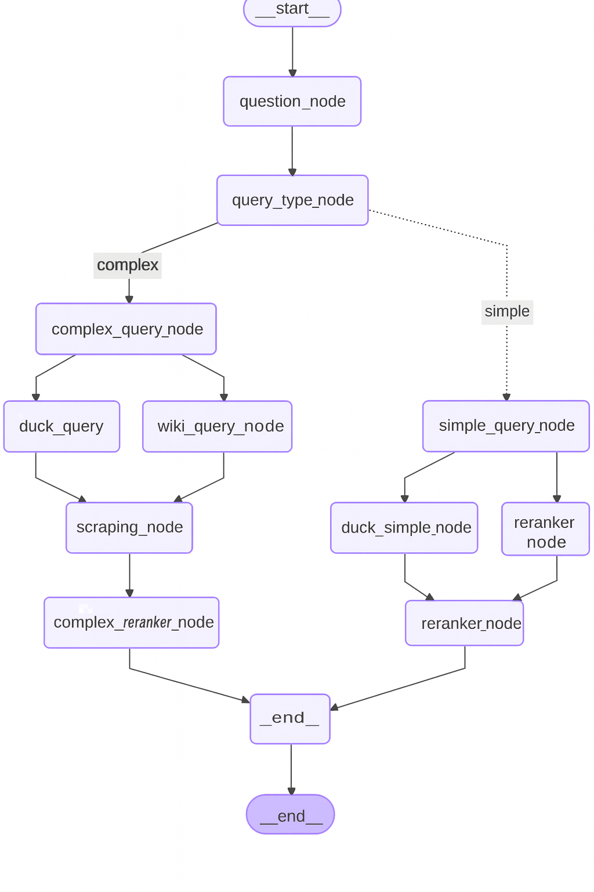

# 🧠 Agentic Web Research Workflow  
**Smart Query Router & Hybrid Web Scraper with Compression-based Reranking**

## 🚀 Project One-liner
A **state-graph-driven AI agent** that intelligently routes user queries (simple vs complex), performs web search & scraping, and outputs **high-quality, contextually compressed evidence** for downstream LLM consumption. Perfect for **RAG pipelines**, knowledge retrieval, or advanced research assistants.


## 🔑 Key Features

1. **LLM-powered query classification**  
   - Detects whether a query is **simple** or **complex** and refactors it for optimal search.  

2. **Adaptive routing**  
   - **Simple queries:** Lightweight Wikipedia + DuckDuckGo search → rerank results.  
   - **Complex queries:** Wikipedia + DuckDuckGo → scrape links → compress + rerank.  

3. **Hybrid retrieval & compression**  
   - Combines **Chroma embeddings**, **Flashrank reranking**, and **ContextualCompressionRetriever** to extract the most relevant passages.  

4. **Modular & testable architecture**  
   - Built with **`langgraph` StateGraph** for clean, conditional orchestration.  
   - Each node is self-contained and easily testable.

5. **Production-ready & extendable**  
   - Ready to plug into **RAG systems**, **research assistants**, or **knowledge bots**.  

---

## 📁 Repo Structure

```

.
├── README.md
├── .env
├── langgraph.json
├── src/
│   ├── tools.py            # Search tool wrappers (DuckDuckGo, Wikipedia)
│   ├── llm_setup.py        # Groq LLM setup
│   ├── embedding_setup.py  # HuggingFace embeddings initialization
│   ├── state.py            # TypedDict & structured outputs
│   ├── node.py             # Graph node functions (search, scraping, reranking)
│   └── graph.py            # StateGraph assembly & conditional routing
|── requirements.txt
└──assets

````

---

## 🛠 Core Components

| Module | Purpose |
|--------|---------|
| `tools.py` | Wraps DuckDuckGo and Wikipedia search tools. |
| `llm_setup.py` | Initializes LLM (Groq Llama 3.3 70B) with `.env` key. |
| `embedding_setup.py` | HuggingFace MiniLM embeddings for Chroma. |
| `state.py` | Defines `AgentState` & `query_type_structure` for LLM structured outputs. |
| `node.py` | Implements: query classification, search nodes, scraping, simple/complex reranking. |
| `graph.py` | Connects nodes into a **StateGraph**, routing simple/complex queries and producing final results. |

---

## ⚙️ Installation

1. **Clone repo & create environment**

```bash
git clone <repo_url>
cd Agentic-Web-Research-Workflow
python -m venv .venv
source .venv/bin/activate    # Windows: .venv\Scripts\activate
````

2. **Install dependencies**

```bash
pip install -r requirements.txt
playwright install
```

3. **Configure environment variables**

Create `.env`:

```
GROQ_API_KEY=your_groq_api_key_here
HUGGING_FACE_KEY=your_hugging_face_api_key_here
```

---

## 🏃 How to Run

Run:

```bash
 langgraph dev
```


---

## 💡 Design Decisions

* **Structured query outputs:** LLM returns `{refactored_query, query_complexity}` → minimizes noisy search results.
* **Two-tier reranking:** Simple queries only use top search results; complex queries scrape additional pages before compression.
* **Compression + Contextual Retriever:** Reduces irrelevant information, increases downstream LLM performance.
* **Modular nodes:** Each node returns a partial state dict → easy testing, extension, or replacement.

---

## 🔮 Future Enhancements

* Cache Chroma embeddings for speed & persistence.
* Add more search providers: Semantic Scholar, ArXiv API, Google CSE.
* Query paraphrasing / iterative decomposition for complex queries.
* Streamlit/FastAPI web UI for reranked evidence review.
* Replace local embeddings with high-performance OpenAI embeddings.
* Unit tests & CI/CD integration for graph nodes.

---


## 📜 License

MIT — Feel free to reuse, fork, or extend.

---

